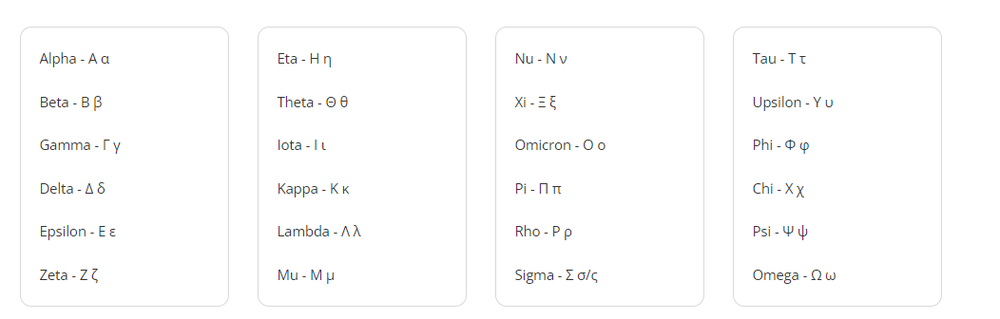

# Introduction: Mathematics for Business and Economics

- Mathematics per se **not** a distinct field in business and economics 

- We use mathematics **as an approach** to study reality

- It is not hard to think about business and economic models which were initially not mathematical
    - Consumer choice through utility maximization
    - Firm pricing and profit maximization

- Modern researchers represent models using math
    - Allows to extend the model using mathematical "laws"
    - Makes models less subject to interpretation
    - Allows for statistical testing of hypotheses

# Is it so challenging?

- Math is often feared because of its complexity
    
- Often the reason people fail is poor foundations

- Must master basic concepts before moving to more complex ones
    - This means that math takes time and few have the patience for it
    - Comparing yourself to others is **not useful**
    - Some have better foundations, some have inherent talent, some have more time

# Order of operations

- The order of operations defines the priority of operations in an expression

- This is a consensus which everyone agreed to so we can all understand each other
    - Calculators and statistical software follow this order
    - As basic as this is, this is tested on the GRE (graduate school entrance exam)

- **PEMDAS**: **P**arentheses, **E**xponents, **M**ultiplication and **D**ivision, **A**ddition and **S**ubtraction

- If two operations have the same priority, we go from left to right. 

- No sign means multiplication

# Exercise {.incremental}

## Order of operations

Calculate the following expression:

$$ 3 + 4 \times 2^2(3+1\times 3 \div 3)  + 4-5 +5$$

# Solution

## Order of operations

- Start with the parentheses. Apply PEMDAS within too.

$$ 4 \times 1 = 4$$

- Substitute into the full expression, follow order, and solve
\begin{align*}
3 + 4 \times 2^2(4)  + 4-5 +5 \\
3 + 4 \times 4(4)  + 4-5 +5 \\
3 + 4 \times 16  + 4-5 +5 \\
3 + 64  + 4-5 +5 \\
67 + 4-5 +5 \\
71 - 5 + 5 \\
71
\end{align*}

# Thoughts

- As useless this might be with numbers, it is crucial when working with variables
    - E.g. What does $\lambda_1 (x_1 + x_2) \times \lambda_1 x_1 + x_2^2 (\tau \cdot \gamma)$ simplify to?

-  Calculators typically don't work with variables

- Not understanding PEMDAS may lead you to code the wrong formula in your software
    - It is hard to debug this as it not a syntax error

# Variables and the greek alphabet

- Variables are used to represent unknowns in equations
    - Technically, they are placeholders for numbers

- $x$ is commonly used, $y$ and $z$ are common too

- Scientists need more variables as they study more complex systems
    - The greek alphabet is used for this

- Get comfortable seeing and using the greek alphabet

# The Greek alphabet

- Commonly, the same letter is used for different purposes in different fields and contexts
    - $\beta$ represents the slope coefficient, but also the discount factor in finance

# Working with percentages and proportions

- Percentages are a way to express a fraction of a whole (the symbol being %)

- The word "percent" means "per hundred"; meaningful for calculation

$$\text{Percentage} \% = \frac{\text{Part}}{\text{Whole}} \times 100 \% $$

- A useful way of thinking about percentages is as *proportions*: the decimal representation of the percentage
    - Divide by 100 and drop the % sign
    - 50% is 0.50, 25% is 0.25, 100% is 1.00

- This is useful for calculations so you don't use the above formula all the time

- Example: A 25% discount on a \$75 item is $0.25 \times 75 = 18.75$

# Working with percentages and proportions

- Example: What is the final price of a \$75 item with a 25% discount?

- You may be tempted to use the rule of three, but this is not necessary (it takes longer)

- Use proportions to understand that 1 reprents the full price (the $75) and 0.25 represents the discount.

$$ \$75 \cdot (1 - 0.25) = \$75 \cdot 0.75 = \$56.25$$

- Notice that the new final price is 75% of the original price, so this makes sense!
    - Don't be afraid to use your intuition
    - Business analysts and economists are not math machines, we use intuition to guide us

# Percentage change and subindices

- It is common to express increases and decreases in percentages

- This involves introducing the concept of **variation**
    - Typically, we express change or variation as $\Delta$

- Often, we use subindices to represent the old and new values
    - E.g. $x_0$ is the old value, $x_1$ is the new value

- The formula for percentage change is

$$ \Delta \% = \frac{\text{New} - \text{Old}}{\text{Old}} \times 100 \% = \frac{x_1 - x_0}{x_0}\times 100 $$

- A shorthand for this is dividing the final value by the initial value and subtracting 1
    - A negative value means a decrease, a positive value means an increase

# Solving for a final value after a percentage change

- Example: A company gives employees a 10% raise. If an employee currently earns \$46,000 per year, what would the new salary be?

- Typically, one would calculate 10% of \$46,000 and add it to the original value.

$$ x_0 + (x_0 \cdot \Delta\%) = x_1 $$

- It is faster to represent $\Delta\%$ as a proportion, add it to 1, and multiply by the original value (1 + 0.10 = 1.10)

- Doing this is a simplification from the formula above

- However, it is also intuitive, since you're simply finding a value which is 10% larger than the whole (which is 1). 

- So, the new salary is \$46,000 $\times$ 1.10 = \$50,600

# Solving for a final value after a percentage change

- The same can be done for percentage *decreases*

- Example: A store's weekly revenue has decreased by 5%. If revenue was \$500, what is the new weekly revenue?

- The new weekly revenue is \$500 $\times$ (1-0.05) = \$500 $\times$ 0.95 = \$475

- Once again, this is intuitive: the new revenue is only 95% of the original revenue

# An exercise for you

- Example: A coffee drink in Toronto costs CAD 3.50 after a 15% sales tax. How much tax is the consumer paying?

# Solution

- The stated price (\$3.50) is the total paid after tax, so the pre-tax price $P_0$ satisfies $P_0 \cdot 1.15 = 3.50$

- Solving: $P_0 = 3.50 / 1.15 \approx 3.04$, so the tax is $3.50 - 3.04 \approx \$0.46$

- If instead you computed $15\% \times \$3.50 = \$0.525$ — that is wrong, because the tax applies to $P_0$, not the final price

- Key lesson: always be clear about what the "whole" is in the percentage formula

# Ratios

- Ratios are a way to express the relationship between two parts of a whole
    - Not the same as the percentage, which is the relationship of a part to the whole

- They are often expressed as 1 to 2, 1:2. 

- These can be a bit confusing, but context is helpful.
    - A ratio of 1:2 means that for every 1 unit of the first part, there are 2 units of the second part
    
- Example: A company allocates budget between R&D and marketing in a ratio of 1:2, meaning for every \$1 in R&D, \$2 goes to marketing.

# Ratios

- You can work out the the relationship from one part to the whole by adding the parts of the ratio.
    - This may or may not make sense depending on the context

- With a ratio of 1:2 for R&D and marketing, the whole is 3 parts, but this is not meaningful on its own

- However, if you're told that in a hospital the ratio of doctors to nurses is 1:2, then doctors are 1/3 of the whole staff

# Application: sales tax changes and percentage change interpretations

- Suppose a sales tax rate rises from 12% to 15%

- Question for you: which the following statements is correct?
    1. There was a 3 percentage point increase in the sales tax rate
    2. There was a 25% increase in the sales tax rate
    3. There was a 15% increase in the sales tax rate

# Percentage points and percent changes

- When the quantity being analyzed is itself a percentage, we need to distinguish two concepts

- **Percentage point change**: the absolute difference — $15\% - 12\% = 3$ percentage points (statement 1)

- **Percent change**: the relative change — $(15 - 12)/12 \times 100 = 25\%$ (statement 2)

- Both statements 1 and 2 are correct; they measure the same change in different ways

- Statement 3 is wrong — $15\%$ is the new rate, not the change

# Equations 

- An equation is a statement that two expressions are equal, typically with an unknown.
    - E.g. $x + 2 = 5$
    
- We often care about solving equations, which means finding the value of the unknown that makes the equation true (i.e. satisfies the equation)
    - For above, $x = 3$ will make the equation true (5 = 5)

- Equations can be solved by isolating the unknown on one side of the equation, and doing the math.

# Equations

- There are rules for solving equations:
    - You can add or subtract the same value to both sides
    - You can multiply or divide both sides by the same value
    - Exponents must be raised to the same power on both sides
    - You can take the square root of both sides by adding $\pm$
    - We will see more rules as we go along

# Functions

- A function is a rule that assigns a unique output to each input
    - Think of it as a machine that takes an input and gives an output
    - We stop caring about solving for the unknown, and care about the relationship between the input and output

- Functions are often represented as $f(x)$, where $f$ is the function and $x$ is the input
    - The value of the function at $x$ is $f(x)$

- A function doesn't necessarily have to be a mathematical formula, but it is often represented as one

- Economists and business analysts use functions to represent real-world relationships
    - E.g. the relationship between advertising and sales
    - E.g. the relationship between price and quantity demanded

- Functions can be linear, quadratic, exponential, logarithmic, etc.

# Functions

- The simplest function is the constant function, which always returns the same value
    - E.g. $f(x) = 5$

- Notice how this challenges our equation solving skills
    - There is no unknown to solve for
    - If we input 3, we get 5, if we input 10, we get 5

- A linear function is the next simplest.
    - E.g. $f(x) = 2x + 3$
    - Here we do have an input $x$ which goes into the function
    - The function multiplies the input by 2, adds 3, and returns the result
    - It's called linear because the graph of the function is a straight line

# Functions: domain and range

- The **domain** of a function is the set of all possible inputs
    - For $f(x) = 2x + 3$, the domain is all real numbers ($\mathbb{R}$)

- The **range** of a function is the set of all possible outputs
    - For $f(x) = 2x + 3$, the range is all real numbers ($\mathbb{R}$)

- The domain and range are important to understand the behavior of the function

# Functions: domain and range

- Some functions have a restricted domain because of the way the equation is defined
    - E.g. $f(x) = \frac{1}{x}$ has a domain of all real numbers except 0
    - The function is not defined at 0 because there is no such thing as division by 0

- The domain and range are often represented as intervals
    - E.g. $x \in (-\infty, 0) \cup (0, \infty)$
    - E.g. $f(x) \in (-\infty, 0) \cup (0, \infty)$

- Without differential calculus, to find the domain and range of a function easily, you can plot it
    - With some time, you will start recognizing the behavior of functions

# Inequalities

- Inequalities are statements that two expressions are not equal
    - E.g. $x > 5$

- When we have more elaborate expressions, we can have more complex inequalities
    - E.g. $2x + 3 > 5$
    - Simplify using the rules of equations to find which values of $x$ make the inequality true.
    - E.g. $2x > 2$, $x > 1$. This means that all values of $x$ greater than 1 make $2x + 3 > 5$ true.

- Use the same rules as equations to solve inequalities, except when multiplying or dividing by a negative number
    - In this case, the inequality sign flips
    - E.g. $-2x < 6$, $x > -3$

- Inequalities are often used to represent constraints in optimization problems

